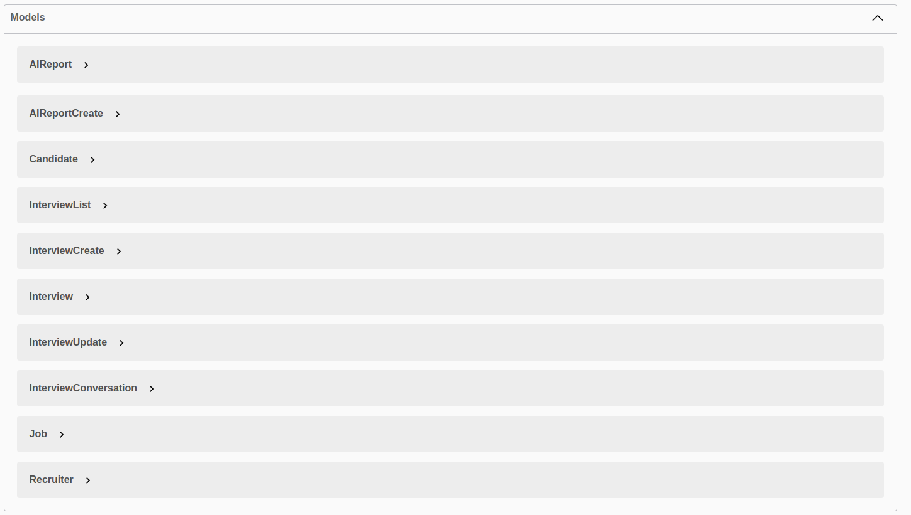

# API Reference

Welcome to the <strong>Recos API Reference</strong>. You will find everything you need to integrate with, test, and explore the API endpoints that power the Recos platform.

---

## Live API Docs

- **Postman Online Docs:** [View Postman Documentation](https://documenter.getpostman.com/view/45699975/2sB3HqHJX4)
- **Swagger UI:**

---

## API Documentation Screenshots

| Swagger UI Example | Postman API Docs Example |
|--------------------|-------------------------|
|  |  |
|  |  |
|  |  |

---

## Main Endpoints

Below are the core API endpoints available in Recos. All endpoints follow REST conventions and require authentication.

### Authentication

<pre class="api-dark">
POST   /register/           # Recruiter registration
POST   /login/              # Login
POST   /logout/             # Logout
</pre>

### Password Management

<pre class="api-dark">
POST   /forgot-password/          # Start password reset
POST   /reset-password/           # Complete password reset
POST   /verify-reset-code/        # Verify reset code sent to email
</pre>

### Recruiter & Profile

<pre class="api-dark">
GET    /users/                    # List all recruiters
PUT    /update-profile/           # Update your profile
DELETE /delete-account/           # Delete your account
</pre>

### Odoo Integration

<pre class="api-dark">
POST   /verify-odoo/              # Verify Odoo account
POST   /odoo-credentials/         # Add Odoo credentials
GET    /odoo-credentials/list/    # List Odoo credentials
GET    /companies/                # List companies
GET    /companies/&lt;company_id&gt;/jobs/    # Get jobs by company
</pre>

### Jobs & Candidates

<pre class="api-dark">
GET    /jobs/                     # List all jobs
GET    /jobs/&lt;job_id&gt;/candidates/ # Get candidates for a specific job
GET    /candidates/               # List all candidates
GET    /candidates/&lt;candidate_id&gt;/attachments/   # Candidate attachments
GET    /candidates/&lt;candidate_id&gt;/attachments/download/&lt;attachment_id&gt;/   # Download attachment
</pre>

### Sync Operations (Odoo Data)

<pre class="api-dark">
POST   /sync/jobs/company/&lt;company_id&gt;/          # Sync jobs for a company
POST   /sync/jobs/handle-duplicates/             # Sync jobs & handle duplicates
POST   /sync/jobs/user/                          # Sync jobs for logged-in user
POST   /sync/candidates/job/&lt;job_id&gt;/            # Sync candidates for a job
POST   /sync/candidates/company/&lt;company_id&gt;/    # Sync candidates by company
POST   /sync/candidates/all/                     # Sync all candidates
POST   /sync/candidates/&lt;candidate_id&gt;/attachments/   # Sync candidate attachments
</pre>

### Interview Management

<pre class="api-dark">
POST   /interviews/create/                                   # Create interview
POST   /interviews/&lt;interview_id&gt;/create-calendar-event/     # Add interview to Google Calendar
GET    /interviews/&lt;interview_id&gt;/analytics/                 # Get interview analytics (AI/Gemini)
</pre>

### AI Reports & Conversations

<pre class="api-dark">
GET    /interview_conversations/     # List all interview conversations
GET    /ai-reports/                  # List all AI reports
</pre>

### Google Calendar & OAuth

<pre class="api-dark">
GET    /auth/google/initiate/    # Start Google OAuth
GET    /auth/google/callback/    # Google OAuth callback
GET    /api/auth/google/callback/# API-level OAuth callback
</pre>

---

## Example API Usage

### Odoo Integration

- <strong>Verify Odoo Account:</strong>

<pre class="api-dark">
POST /verify-odoo/
{
  "instance_url": "https://your-odoo.com",
  "email": "you@example.com",
  "api_key": "..."
}
</pre>

- <strong>Fetch Jobs from Odoo:</strong>

<pre class="api-dark">
GET /odoo/jobs
</pre>

- <strong>Fetch Candidates from Odoo:</strong>

<pre class="api-dark">
GET /odoo/candidates
</pre>

---

### Google Calendar / Meet Integration

- <strong>Schedule Interview Event:</strong>

<pre class="api-dark">
POST /interviews/{interview_id}/create-calendar-event/
</pre>

- <strong>Create Google Calendar Event:</strong>

<pre class="api-dark">
POST /calendar/events
</pre>

- <strong>Get All Google Meet Links:</strong>

<pre class="api-dark">
GET /calendar/meets
</pre>

---

### AI, AssemblyAI, and Gemini

- <strong>Start Interview with AI Assistant (transcription):</strong>

<pre class="api-dark">
POST /interviews/create/
</pre>

- <strong>Get Post-Interview Analytics:</strong>

<pre class="api-dark">
GET /interviews/{interview_id}/analytics/
</pre>

---

### Attachments

- <strong>Get Candidate Attachments:</strong>

<pre class="api-dark">
GET /candidates/{candidate_id}/attachments/
</pre>

- <strong>Download Attachment:</strong>

<pre class="api-dark">
GET /candidates/{candidate_id}/attachments/download/{attachment_id}/
</pre>

---

## API Testing & Documentation

- **All APIs are tested in Postman.**
- See [Postman Docs](https://documenter.getpostman.com/view/45699975/2sB3HqHJX4).
- See screenshots above for Swagger UI and Postman documentation examples.

---

## Security & Authentication

- Endpoints require authentication via JWT or session.
- Store API keys and secrets in environment variables (`.env`), **never** commit secrets to your repository.

---

## More Information

- For a full list of all endpoints and models, see the [Developer Docs](developer-docs.md).
- For architecture and integration details, see [Developer Docs](developer-docs.md) and [Integrations](integrations.md).

---

---

