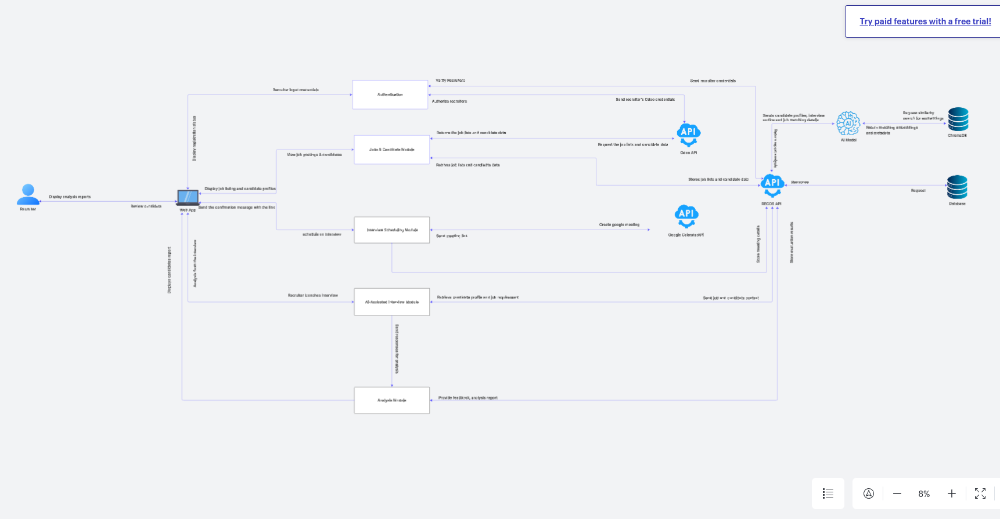

# Developer Docs

## System Architecture

- **Frontend:** Next.js + Tailwind + TypeScript (Vercel)
- **Backend:** Python, Django REST Framework
- **Integrations:** Odoo, Google Calendar, AssemblyAI, Gemini
- **CI/CD:** GitHub Actions, Vercel

---

## .env Usage

- All sensitive values (API keys, secrets) are stored in `.env`
- Never commit `.env` to source control

## Automated Testing

- All APIs tested with Postman
- Unit and integration tests required for every PR

---

## API Documentation

- [Swagger UI](http://127.0.0.1:8000/api/swagger)
- Postman collection and docs

---