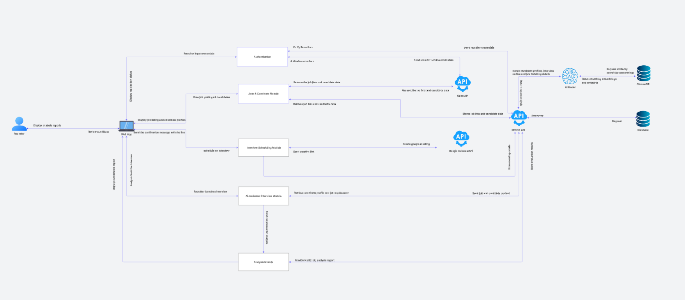
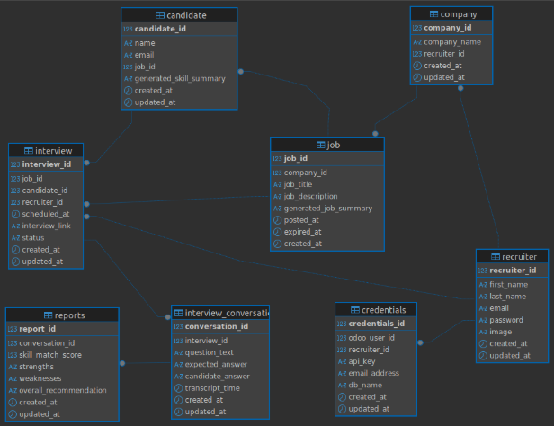

# <span style="font-weight: 1; font-size: 2.1em; color: #232f3e;">Developer Docs</span>

Comprehensive documentation for developers building, testing, and deploying this platform.  
Learn more about the architecture, workflows, best practices, and integration details.

---

## <span style="font-weight: 300; color: #8645e8;">System Architecture</span>



- <span style="color: #232f3e;"><b>Frontend:</b></span> Next.js + Tailwind CSS + TypeScript (deployed on Vercel)
- <span style="color: #232f3e;"><b>Backend:</b></span> Python, Django REST Framework
- <span style="color: #232f3e;"><b>Database:</b></span> PostgreSQL
- <span style="color: #232f3e;"><b>Cache:</b></span> Redis (sessions, verification codes, performance)
- <span style="color: #232f3e;"><b>Integrations:</b></span> Odoo ERP, Google Calendar API, AssemblyAI (transcriptions), Gemini (AI analytics)
- <span style="color: #232f3e;"><b>CI/CD:</b></span> GitHub Actions, Vercel
- <span style="color: #232f3e;"><b>Backend Deployment:</b></span> Heroku (Django app)
- <span style="color: #232f3e;"><b>Monitoring:</b></span> Sentry (error tracking), logging in Django and Vercel dashboards
- <span style="color: #232f3e;"><b>Backend Logs:</b></span> Heroku logs were checked regularly to collect error traces and debug production issues

---

## <span style="font-weight: 300; color: #8645e8;">Database Schema</span>



---

## <span style="font-weight: 300; color: #8645e8;">.env Usage & Secrets Management</span>

- All sensitive values (**API keys, secrets**) are stored in `.env`
- **Never commit `.env`** to source control; add it to `.gitignore`
- Use environment variables for config overrides (dev, staging, production)
- For Django, load envs with [`python-dotenv`](https://github.com/theskumar/python-dotenv)
- For Next.js, use `process.env.VAR_NAME`

---

## <span style="font-weight: 300; color: #8645e8;">Automated Testing</span>

- API endpoints tested with **Postman** & **Jest** (frontend API calls)
- **Unit tests:** Every Django model, serializer, and view (`pytest`, `unittest`)
- **Frontend tests:** React components with `Jest` and `React Testing Library`
- **Integration tests:** API endpoints, user flows (authentication, interview scheduling)
- **Test coverage:** Generated on CI, reports in PRs
- **Commands:**
  ```bash
  # Backend
  python manage.py test
  pytest --cov=backend

  # Frontend
  npm test
  npm run coverage
  ```
---

## <span style="font-weight: 300; color: #8645e8;">API Documentation</span>

- **Swagger UI:** Available at `/api/swagger` in development
- **Postman Collection:**  
  [View Postman Documentation](https://documenter.getpostman.com/view/45699975/2sB3HqHJX4)
---

## <span style="font-weight: 300; color: #8645e8;">Coding Standards & Quality</span>

- **Linting:**
  - Frontend: `eslint` (`npm run lint`)
  - Backend: `black`
- **Formatting:**
  - Frontend: `prettier` (`npm run format`)
  - Backend: `black`
- **Type Checking:**
  - Frontend: TypeScript (`tsc`)
  - Backend: `mypy`
- **Style Guides:**  
  - [Next.js Best Practices](https://nextjs.org/docs)
  - [Django REST Framework Style](https://www.django-rest-framework.org/)
---

## <span style="font-weight: 300; color: #8645e8;">Branching & PR Workflow</span>

- **Branch types:**
  - Feature branches: `feature/xxx`
  - Bugfix branches: `bugfix/xxx`
- **PR reviews:** Required for all merges to `main`
- **Descriptive PR titles & linking issues** (use `Fixes #issue_num`)
- **Checklist for PRs:**
  - [x] All tests pass
  - [x] Linting/formatting checks
---

## <span style="font-weight: 300; color: #8645e8;">Directory Structure</span>

- `frontend/` — Next.js app (React components, pages, styles, API calls)
- `backend/` — Django project (models, views, serializers, API)
- `docs/` — Platform documentation, API reference, developer guides
- `tests/` — Backend and frontend tests, fixtures, mocks
- `scripts/` — Utility scripts for migration, data seeding, etc.

---

## <span style="font-weight: 300; color: #8645e8;">Running Locally</span>

**Setup Steps:**
1. Clone repository  
   ```bash
   git clone https://github.com/your-org/your-repo.git
   cd your-repo
   ```
2. Copy `.env.example` to `.env` and fill all secrets  
   ```bash
   cp .env.example .env
   ```
3. **Install dependencies:**
   - Backend:
     ```bash
     pip install -r backend/requirements.txt
     python manage.py migrate
     ```
   - Frontend:
     ```bash
     npm install
     ```
4. **Start servers:**
   - Backend:
     ```bash
     python manage.py runserver
     ```
   - Frontend:
     ```bash
     npm run dev
     ```
5. **Run tests:**
   - Backend:
     ```bash
     python manage.py test
     ```
   - Frontend:
     ```bash
     npm test
     ```
6. **Lint and format:**
   - Backend:
     ```bash
     flake8 backend/
     black backend/
     ```
   - Frontend:
     ```bash
     npm run lint
     npm run format
     ```

---

## <span style="font-weight: 300; color: #8645e8;">Deployment</span>

- **Frontend:** Deploys automatically to Vercel from `main`
- **Backend:** Deployed on Heroku. CI/CD pipeline via GitHub Actions.
- **Production environment variables:** Set up in Vercel (frontend) and in Heroku dashboard for backend
- **Database migrations:**  
  ```bash
  python manage.py migrate
  ```
- **Heroku Logs:**  
  Regularly check logs using:
  ```bash
  heroku logs --tail --app <your-heroku-app-name>
  ```
  This helps in collecting error traces and debugging production issues.

---

## <span style="font-weight: 300; color: #8645e8;">Monitoring & Logging</span>

- **Sentry:** Error monitoring for frontend and backend
- **Django Logging:** Configured via `settings.py`  
- **Heroku Logging:** Access with `heroku logs --tail`
- **Vercel Logging:** Access via Vercel dashboard

---

## <span style="font-weight: 300; color: #8645e8;">Integrations Reference</span>

- <span style="color: #232f3e;"><b>Odoo:</b></span>  
  - API details, authentication flow
  - Example endpoint: `/api/connect-odoo`
- <span style="color: #232f3e;"><b>Google Calendar:</b></span>  
  - OAuth setup, event creation, calendar sync
  - Endpoint: `/api/google-calendar`
- <span style="color: #232f3e;"><b>AssemblyAI:</b></span>  
  - Transcript API usage, webhook setup
- <span style="color: #232f3e;"><b>Gemini:</b></span>  
  - AI analytics, interview reports

---

## <span style="font-weight: 300; color: #8645e8;">Additional Utilities & Scripts</span>

- **Database reset:**  
  ```bash
  python manage.py flush
  ```
- **Create superuser:**  
  ```bash
  python manage.py createsuperuser
  ```
- **Frontend build:**  
  ```bash
  npm run build
  ```
- **API schema export:**  
  ```bash
  python manage.py spectacular --file schema.yml
  ```

---
