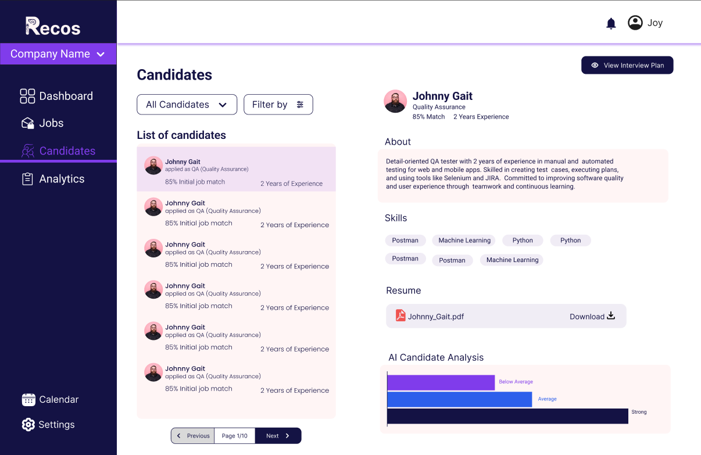
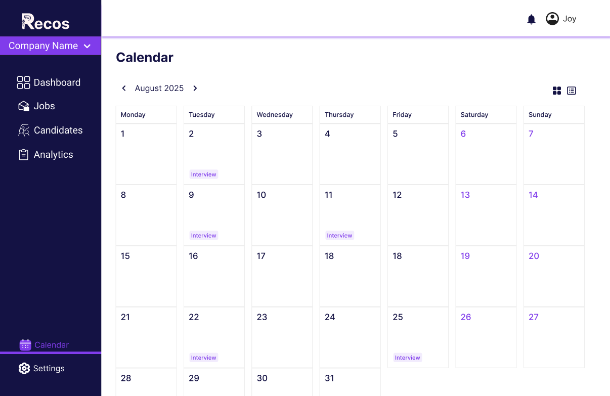
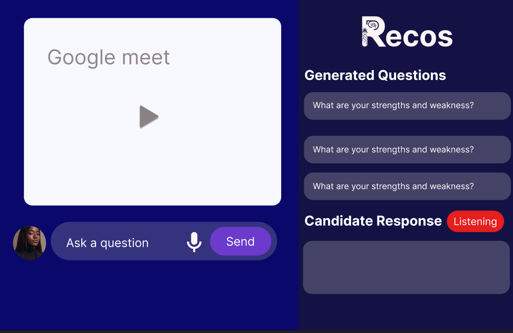
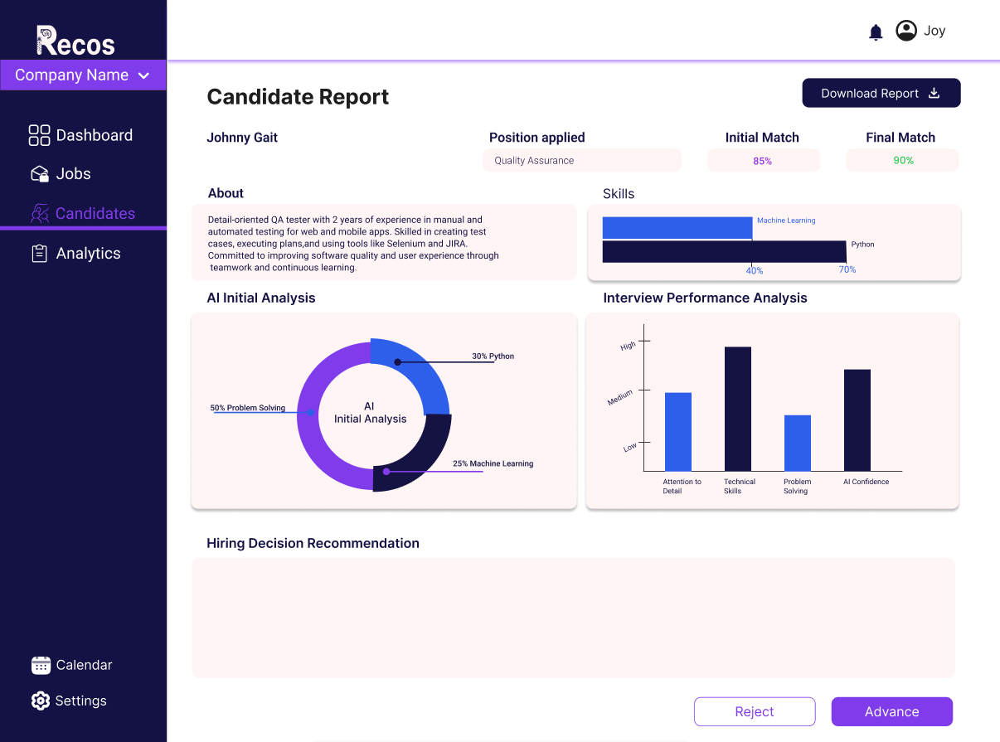

# Platform Features

Explore the core features of our platform, designed to streamline your recruitment and interview process with powerful integrations and AI-driven insights.

---

## 1. Candidate & Job Management

- <b>Fetch and Manage Jobs/Candidates:</b>  
  Connect seamlessly with your Odoo instance to import jobs and candidates automatically, keeping your database up to date.
- <b>Centralized Profile Management:</b>  
  View, edit, and manage candidate profiles, job postings, and company information in one unified dashboard.

---

## 2. Interview Scheduling

- <b>Google Meet Integration:</b>  
  Effortlessly schedule interviews with auto-generated Google Meet links for virtual meetings.
- <b>Calendar Sync:</b>  
  Sync all interviews with your Google Calendar to avoid double bookings and keep organized.
- <b>Automated Reminders:</b>  
  Candidates and recruiters receive timely reminders for upcoming interviews.

---

## 3. AI-Assisted Interviews

- <b>Live Transcription (AssemblyAI):</b>  
  Record and transcribe interviews in real-time for accurate assessment and note-taking.
- <b>Gemini-Powered Interview Reports:</b>  
  Get instant AI-driven analytics, summaries, and sentiment analysis for each interview.

---

## 4. Reporting & Insights

- <b>Candidate Strengths & Gaps:</b>  
  Visualize candidate skills, strengths, and improvement areas based on interview and profile data.
- <b>Ratings & Recommendations:</b>  
  Get automated ratings, feedback, and recommendations for candidate advancement.
- <b>Export Reports:</b>  
  Export interview and candidate analytics to PDF or Excel for sharing and record-keeping.

---

