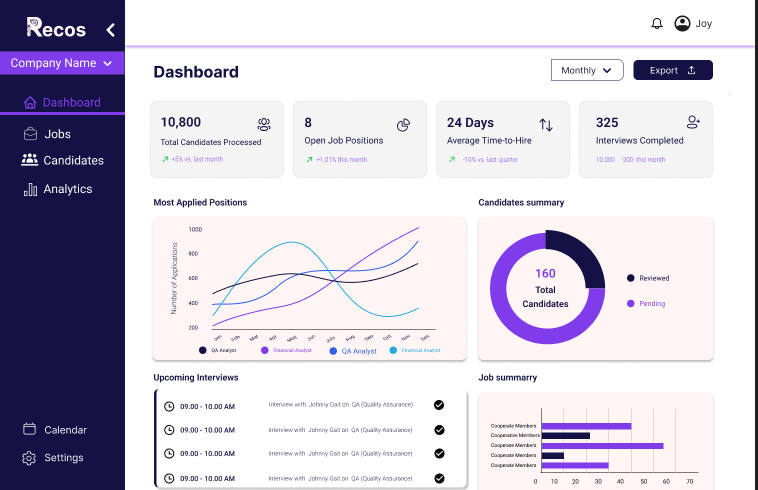

# Features

## Candidate & Job Management

- Fetches and manages jobs/candidates from Odoo.
- Centralized profile management.

## Interview Scheduling

- Google Meet integration and calendar sync.

## AI-Assisted Interview

- Live transcription (AssemblyAI)
- Gemini-powered interview reports

## Reporting & Insights

- Candidate strengths, gaps, ratings, recommendations.

---

### Example Feature Card

|  | **Interview Scheduling** | Schedule interviews, sync with Google Calendar, auto-generate Meet links. |

---