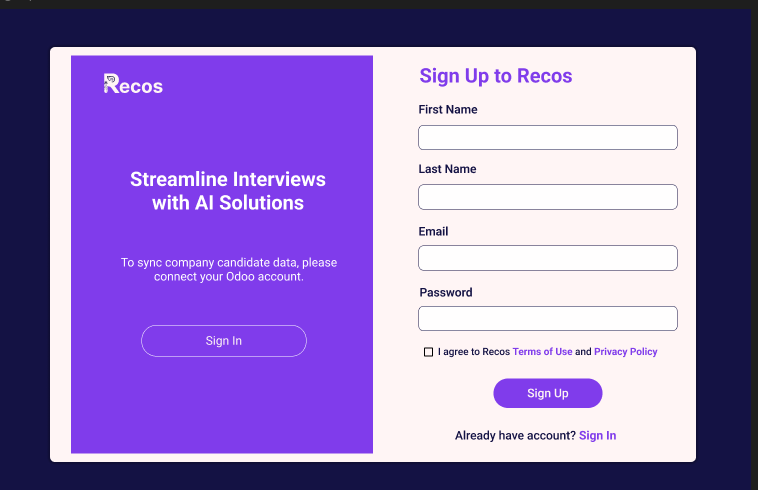
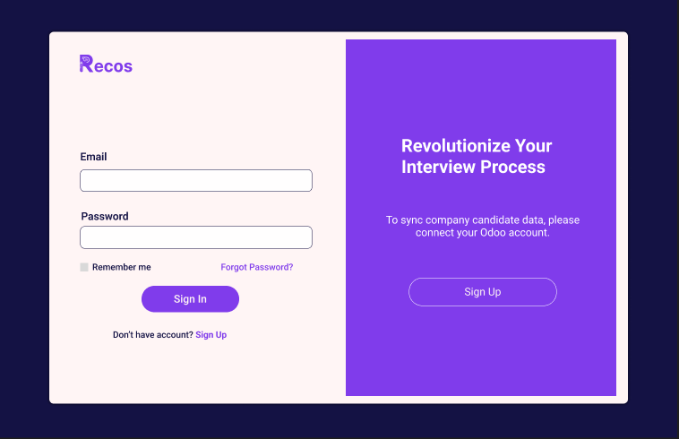
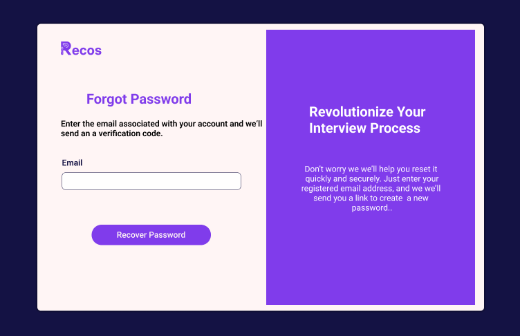
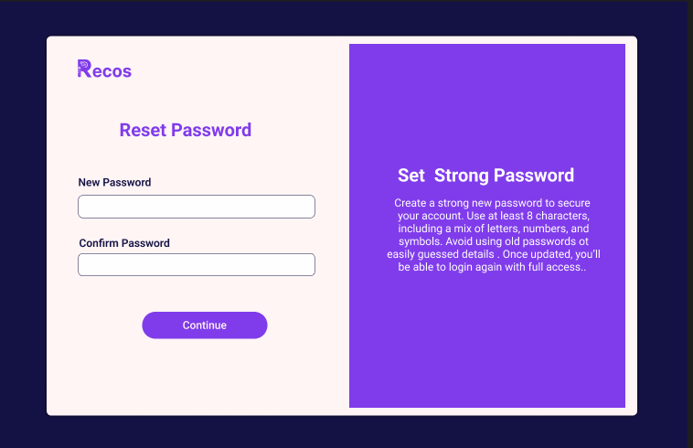
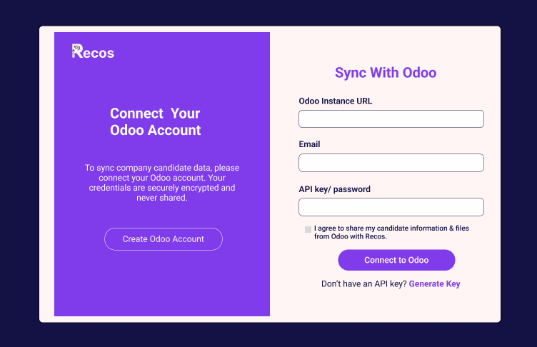
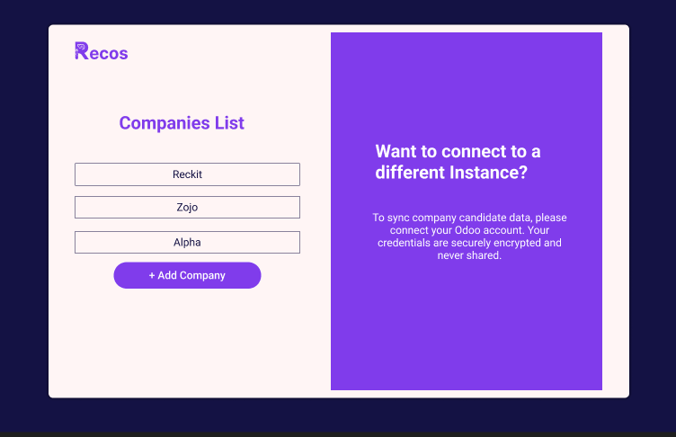

# Getting Started

Welcome to the platform! This section guides you through account creation, authentication, password reset flows, and connecting your Odoo account. Each step includes technical details and backend logic.

---

### 1. Sign Up

To create a new account, fill out the following fields:

- <b>First Name</b>
- <b>Last Name</b>
- <b>Email</b>
- <b>Password</b>

**How it works:**
- The backend creates a new user record after validating the fields.
- Passwords are securely hashed.

<pre class="api-dark">
POST   /api/signup
</pre>

**Sample Request (Frontend → Backend):**

<pre class="api-dark">
{
  "first_name": "Jacky",
  "last_name": "Uwase",
  "email": "jacky@gmail.com",
  "password": "Kumany1@"
}
</pre>

**Sample Response:**

<pre class="api-dark">
{
  "message": "Account created successfully."
}
</pre>

**Backend Logic:**

<pre class="api-dark">
from rest_framework.views import APIView
from rest_framework.response import Response
from rest_framework import status
from django.contrib.auth.models import User
from django.contrib.auth.hashers import make_password

class SignUpView(APIView):
    def post(self, request):
        first_name = request.data.get('first_name')
        last_name = request.data.get('last_name')
        email = request.data.get('email')
        password = request.data.get('password')
        if not (first_name and last_name and email and password):
            return Response({'error': 'All fields are required.'}, status=status.HTTP_400_BAD_REQUEST)
        if User.objects.filter(email=email).exists():
            return Response({'error': 'Email already exists.'}, status=status.HTTP_400_BAD_REQUEST)
        user = User.objects.create(
            first_name=first_name,
            last_name=last_name,
            email=email,
            username=email,
            password=make_password(password)
        )
        return Response({'message': 'Account created successfully.'}, status=status.HTTP_201_CREATED)
</pre>

---

### 2. Login

If you already have an account, sign in using:

- **Email**
- **Password**

<pre class="api-dark">
POST   /api/login
</pre>

**Sample Request:**

<pre class="api-dark">
{
  "email": "jacky@gmail.com",
  "password": "Kumany1@"
}
</pre>

**Sample Response:**

<pre class="api-dark">
{
  "token": "jwt-token"
}
</pre>

**Backend Logic:**

<pre class="api-dark">
from rest_framework_simplejwt.tokens import RefreshToken

class LoginView(APIView):
    def post(self, request):
        email = request.data.get('email')
        password = request.data.get('password')
        user = authenticate(username=email, password=password)
        if user is not None:
            refresh = RefreshToken.for_user(user)
            return Response({'token': str(refresh.access_token)})
        return Response({'error': 'Invalid credentials.'}, status=status.HTTP_401_UNAUTHORIZED)
</pre>

---

### 3. Forgot Password Flow

If you forget your password, follow these steps:

#### <b>a. Initiate Password Reset</b>

- Click **"Forgot Password?"** on the login page.
- Enter your registered email address.

<pre class="api-dark">
POST   /forgot-password/          # Start password reset
</pre>

**Sample Request:**

<pre class="api-dark">
{
  "email": "jacky@gmail.com"
}
</pre>

**Sample Response:**

<pre class="api-dark">
{
  "message": "Password reset code sent."
}
</pre>

**Backend Logic:**

<pre class="api-dark">
class ForgotPasswordView(APIView):
    permission_classes = [permissions.AllowAny]

    def post(self, request):
        email = request.data.get('email', '').lower().strip()
        if not email:
            return Response({'error': 'Email is required'}, status=status.HTTP_400_BAD_REQUEST)

        try:
            user = Recruiter.objects.get(email=email)
        except Recruiter.DoesNotExist:
            return Response({'message': 'Password reset code sent if email exists in our system'}, status=status.HTTP_200_OK)

        verification_code = ''.join(random.choices('0123456789', k=4))
        cache.set(f'reset_code_{email}', verification_code, timeout=3*60)

        subject = 'Password Reset Verification Code'
        message = (
            f"Hello {user.first_name},\n\n"
            f"We received a request to reset your password. Use the verification code below:\n\n"
            f"{verification_code}\n\n"
            f"This code will expire in 3 minutes.\n\n"
            f"If you didn't request this, please ignore this email.\n\n"
            f"Thank you,\nThe Team"
        )

        send_mail(subject, message, settings.DEFAULT_FROM_EMAIL, [user.email], fail_silently=False)
        return Response({'message': 'Password reset code sent.'}, status=status.HTTP_200_OK)
</pre>

---

#### <b>b. Enter Verification Code</b>

After receiving an email, enter the 4-digit code on the verification page.

<pre class="api-dark">
POST   /verify-reset-code/        # Verify reset code sent to email
</pre>

**Sample Request:**

<pre class="api-dark">
{
  "email": "jacky@gmail.com",
  "code": "1234"
}
</pre>

**Sample Response:**

<pre class="api-dark">
{
  "detail": "Code verified, you may now reset your password."
}
</pre>

**Backend Logic:**

<pre class="api-dark">
class VerifyCodeView(APIView):
    permission_classes = [permissions.AllowAny]

    def post(self, request):
        email = request.data.get('email', '').lower().strip()
        code = str(request.data.get('code', '')).strip()
        if not email or not code:
            return Response({'detail': 'Email and code are required.'}, status=status.HTTP_400_BAD_REQUEST)

        cached_code = cache.get(f'reset_code_{email}')
        if cached_code is None:
            return Response({"detail": "Code has expired, please request a new one."}, status=status.HTTP_400_BAD_REQUEST)
        if cached_code != code:
            return Response({"detail": "Invalid code."}, status=status.HTTP_400_BAD_REQUEST)

        request.session['reset_email'] = email
        cache.delete(f'reset_code_{email}')
        return Response({"detail": "Code verified, you may now reset your password."})
</pre>

---

#### <b>c. Reset Password</b>

After code verification, set a new password (two fields: New Password, Confirm New Password).

<pre class="api-dark">
POST   /reset-password/           # Complete password reset
</pre>

**Sample Request:**

<pre class="api-dark">
{
  "email": "jacky@gmail.com",
  "password": "NewStrong1@"
}
</pre>

**Sample Response:**

<pre class="api-dark">
{
  "detail": "Password reset successful."
}
</pre>

**Backend Logic:**

<pre class="api-dark">
class ResetPasswordView(APIView):
    permission_classes = [AllowAny] 

    def post(self, request):
        serializer = ResetPasswordSerializer(data=request.data)
        serializer.is_valid(raise_exception=True)
        email = serializer.validated_data['email']
        password = serializer.validated_data['password']
        try:
            user = User.objects.get(email=email)
        except User.DoesNotExist:
            return Response({"detail": "User with this email does not exist."}, status=status.HTTP_400_BAD_REQUEST)
        user.set_password(password)
        user.save()
        code_storage.pop(email, None)
        return Response({"detail": "Password reset successful."})
</pre>

---

### 4. Connecting to Odoo

After logging in, connect your Odoo account using:

- **Odoo Instance URL**
- **Email**
- **API Key / Password**

<pre class="api-dark">
POST   /api/connect-odoo
</pre>

**Sample Request:**

<pre class="api-dark">
{
  "odoo_url": "https://your-odoo-instance.com",
  "email": "odoo_user@example.com",
  "api_key": "yourOdooApiKey"
}
</pre>

**Sample Response:**

<pre class="api-dark">
{
  "companies": [
    {
      "id": 1,
      "name": "Acme Corp"
    },
    {
      "id": 2,
      "name": "Innovate LLC"
    }
  ]
}
</pre>

**Backend Logic:**

<pre class="api-dark">
import requests

class ConnectOdooView(APIView):
    def post(self, request):
        odoo_url = request.data.get('odoo_url')
        email = request.data.get('email')
        api_key = request.data.get('api_key')
        if not (odoo_url and email and api_key):
            return Response({'error': 'All fields are required.'}, status=status.HTTP_400_BAD_REQUEST)
        # Example Odoo connection logic (pseudo)
        response = requests.post(f"{odoo_url}/api/auth", data={"email": email, "api_key": api_key})
        if response.status_code != 200:
            return Response({'error': 'Odoo authentication failed.'}, status=status.HTTP_401_UNAUTHORIZED)
        # Fetch companies
        companies = requests.get(f"{odoo_url}/api/companies", headers={"Authorization": f"Bearer {api_key}"})
        return Response({'companies': companies.json()}, status=status.HTTP_200_OK)
</pre>

 

---

### 5. Company Selection

After connecting, select a company from your Odoo account to start working.

- The dashboard lists companies fetched from Odoo.
- Choose one to work on.
- If you add a new company in Odoo, click **"Add Company"** to refresh and connect again.

---

