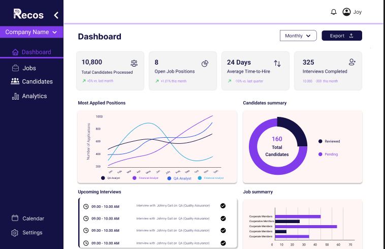

# Getting Started

1. **Sign Up:**  
   Fill in your first name, last name, email, and password.

2. **Login**

3. **Password Reset:**  
   Use the "Forgot Password?" link. A reset code will be sent to your email.

---

## Connecting to Odoo

- Input your Odoo instance URL, email, and API key.
- Example:
  ```
  Odoo Instance URL: https://your-odoo-instance.com
  Email: your@email.com
  API Key: xxxxxxxx
  ```



---

## Company Selection & Dashboard

- After connection, select your company from the list.
- Explore the dashboard for open jobs, candidates, and interviews.

---

## Platform Screenshots

- 
- 