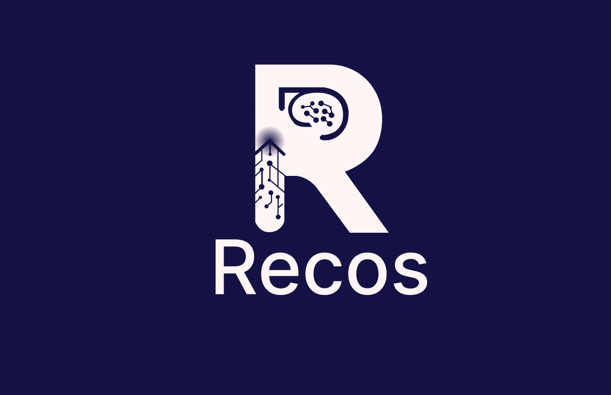
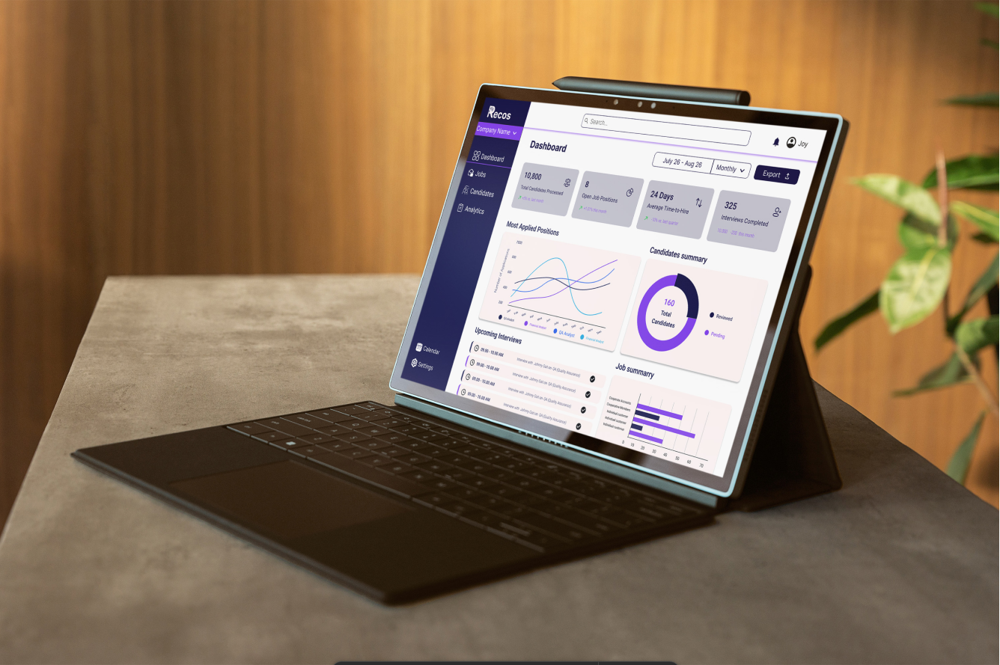

# Home

<!-- Home -->

 
 
 
 

---

  <b>Recos</b> is an intelligent recruitment platform that integrates seamlessly with <b>Odoo</b> and <b>Google Calendar</b>—powered by advanced AI for interviews, reporting, and hiring analytics.

---

## Why Choose Recos?

- **Next-Gen AI:** Automated candidate assessment, interview question generation, and detailed analytics.
- **Odoo Integration:** Instantly connect, sync jobs/candidates, and manage all recruitment data in one place.
- **Google Calendar/Meet:** Effortless interview scheduling with automatic Meet link generation.
- **Real-Time Transcription:** AssemblyAI integration for live interview transcription and Gemini analytics.
- **Tech Stack:** Next.js, Tailwind CSS, TypeScript, Django REST. Deployed with Vercel CI/CD.
- **API-First:** All features accessible via tested REST APIs (see [API Reference](api-reference.md)).

---

## Platform at a Glance

  

---

> _For more about the Recos vision, see our [Informational Website](https://recos-six.vercel.app/)._  
> _Ready to get started? [Jump to the next section](getting-started.md)!_
